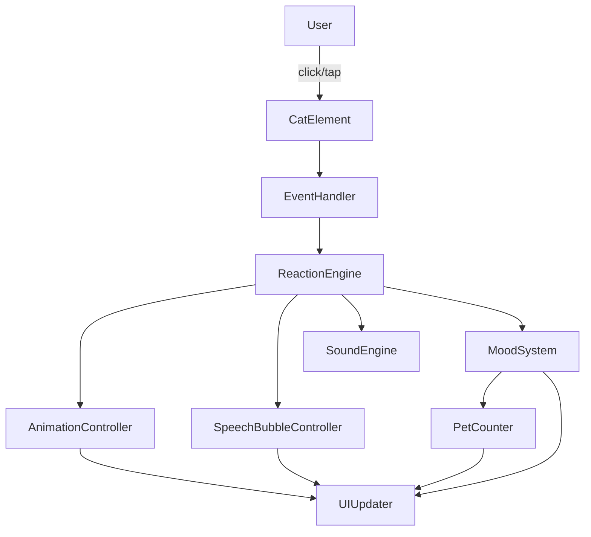

# Design Document: Interactive Pet Cat

## Overview

A single-page web application (single `index.html` file) where users click a minimalist cat character to trigger randomized reactions. The app is built with plain HTML5, Tailwind CSS via CDN, and vanilla JavaScript — no build step, no dependencies beyond the CDN link.

The aesthetic is soft glassmorphism: frosted-glass panels, backdrop blur, subtle shadows, and a pastel gradient background. The experience is intentionally low-stakes and delightful — each pet produces an animation, a speech bubble, and an optional synthesized sound.

Key design goals:
- Zero external assets (sounds generated via Web Audio API)
- Single file delivery
- Works on any modern browser, degrades gracefully on older ones
- Fully responsive from 320 px to 2560 px

---

## Architecture

The entire application lives in one HTML file. JavaScript is organized into logical modules as plain objects/closures inside a `<script>` tag.



**Data flow:**
1. User clicks the cat → `EventHandler` fires
2. `EventHandler` checks if a reaction is already in progress (lock)
3. `PetCounter` increments; `MoodSystem` checks for mood transition
4. `ReactionEngine` picks a random reaction from the current mood's pool (no immediate repeat)
5. `AnimationController`, `SpeechBubbleController`, and `SoundEngine` execute in parallel
6. On animation completion the lock is released

---

## Components and Interfaces

### EventHandler

Attaches a `click` listener to the cat element. Ignores events while `reactionInProgress === true`.

```
EventHandler.init(catElement)
EventHandler.onPet(callback)
```

### PetCounter

Tracks total pets in memory (resets on reload).

```
PetCounter.increment() → number   // returns new count
PetCounter.get() → number
```

### MoodSystem

Holds the current mood and transitions when `PetCounter` hits a multiple of 10.

```
MoodSystem.current() → Mood
MoodSystem.checkTransition(count) → Mood | null  // null = no change
MoodSystem.getReactions() → Reaction[]
```

### ReactionEngine

Selects a reaction, enforces no-immediate-repeat, and orchestrates execution.

```
ReactionEngine.trigger(mood) → void
ReactionEngine.lastReactionId → string | null
```

### AnimationController

Applies a CSS class to the cat element, removes it after the animation duration.

```
AnimationController.play(catElement, animationName) → Promise<void>
```

### SpeechBubbleController

Shows/hides the speech bubble element with fade transitions.

```
SpeechBubbleController.show(message) → void   // auto-hides after 2000ms
SpeechBubbleController.hide() → void
```

### SoundEngine

Wraps Web Audio API. Lazy-initializes `AudioContext` on first pet.

```
SoundEngine.init() → void          // called on first pet
SoundEngine.play(soundType) → void // no-op if unsupported
SoundEngine.supported → boolean
```

### UIUpdater

Syncs DOM state: mood label, pet counter display, mood transition glow.

```
UIUpdater.setCounter(n) → void
UIUpdater.setMood(mood) → void
UIUpdater.triggerMoodTransition() → void
```

---

## Data Models

### Mood

```js
{
  id: string,          // e.g. "happy"
  label: string,       // display text, e.g. "Happy 😊"
  reactions: Reaction[]
}
```

### Reaction

```js
{
  id: string,          // unique identifier
  message: string,     // speech bubble text
  animation: string,   // CSS animation class name
  sound: string | null // sound type key, or null
}
```

### AppState (in-memory singleton)

```js
{
  petCount: number,          // total pets this session
  currentMoodId: string,     // active mood id
  reactionInProgress: boolean,
  lastReactionId: string | null,
  audioContextInitialized: boolean
}
```

### Animation types (minimum 4)

| Name    | CSS class        | Description                  |
|---------|------------------|------------------------------|
| bounce  | `anim-bounce`    | Vertical bounce              |
| shake   | `anim-shake`     | Horizontal shake             |
| spin    | `anim-spin`      | Full 360° rotation           |
| pulse   | `anim-pulse`     | Scale up/down                |

### Mood definitions (minimum 4)

| Mood     | Reactions available |
|----------|---------------------|
| happy    | purr, headbutt, blink, knead |
| sleepy   | yawn, stretch, nap, slow-blink |
| excited  | zoom, chirp, pounce, wiggle |
| grumpy   | hiss, tail-flick, glare, grumble |

Each mood has ≥ 2 reactions, total ≥ 8 distinct reactions across all moods.

### Sound types

| Key     | Description                        |
|---------|------------------------------------|
| purr    | Low-frequency sine wave hum        |
| chirp   | Short high-frequency triangle burst|
| hiss    | Noise burst                        |
| meow    | Frequency-swept sine               |

---

## Correctness Properties

*A property is a characteristic or behavior that should hold true across all valid executions of a system — essentially, a formal statement about what the system should do. Properties serve as the bridge between human-readable specifications and machine-verifiable correctness guarantees.*

### Property 1: Pet increments counter

*For any* initial pet count, clicking the cat once should result in the pet counter increasing by exactly 1.

**Validates: Requirements 2.3**

### Property 2: Reaction lock prevents double-firing

*For any* sequence of rapid clicks while a reaction is in progress, the pet counter should increment by exactly 1 (only the first click is registered).

**Validates: Requirements 2.4**

### Property 3: No immediate reaction repeat

*For any* mood and any sequence of two consecutive pets, the reaction selected for the second pet must differ from the reaction selected for the first pet.

**Validates: Requirements 3.5**

### Property 4: Speech bubble auto-hides

*For any* reaction triggered, the speech bubble should be hidden after 2000 ms have elapsed since it was shown.

**Validates: Requirements 3.3, 5.3**

### Property 5: Mood transition on multiples of 10

*For any* pet count that is a multiple of 10 (and > 0), the mood after the pet should differ from the mood before the pet.

**Validates: Requirements 6.2, 6.5**

### Property 6: Mood transition produces different mood

*For any* mood transition, the newly selected mood must be different from the current mood.

**Validates: Requirements 6.5**

### Property 7: Animation completes within 1000 ms

*For any* animation triggered, the cat element should return to its default visual state within 1000 ms of the animation starting.

**Validates: Requirements 4.2, 4.3**

### Property 8: Sound engine graceful degradation

*For any* browser environment where Web Audio API is unavailable, triggering a pet should not throw an error and the app should continue functioning normally.

**Validates: Requirements 8.4**

### Property 9: Reaction pool coverage

*For any* mood, the set of reactions available must contain at least 2 distinct reactions, and the total across all moods must be at least 8.

**Validates: Requirements 3.1, 6.1**

---

## Error Handling

| Scenario | Handling |
|---|---|
| Web Audio API not supported | `SoundEngine.supported = false`; `play()` is a no-op; no error shown to user |
| AudioContext suspended (autoplay policy) | `SoundEngine.init()` called on first pet event; context resumed before playing |
| Reaction pool exhausted for no-repeat rule | Fall back to any reaction other than the last one |
| All moods identical during transition | Pick any mood (edge case: only 1 mood defined — prevented by data validation at startup) |
| Click during animation | Ignored via `reactionInProgress` flag |

---

## Testing Strategy

### Unit Tests

Focus on specific examples, edge cases, and integration points:

- `PetCounter.increment()` returns correct sequential values
- `MoodSystem.checkTransition(10)` returns a new mood; `checkTransition(9)` returns null
- `MoodSystem.checkTransition` never returns the current mood
- `ReactionEngine` never selects the same reaction twice in a row
- `SpeechBubbleController.show()` sets the correct message text
- `SoundEngine.play()` is a no-op (no throw) when `supported = false`
- Reaction pool has ≥ 8 total reactions across all moods
- Each mood has ≥ 2 reactions

### Property-Based Tests

Use **fast-check** (JavaScript property-based testing library) for universal property validation.

Each property test runs a minimum of **100 iterations**.

Tag format for each test: `// Feature: interactive-pet-cat, Property N: <property text>`

| Property | Test description |
|---|---|
| P1: Pet increments counter | For any starting count, increment → count + 1 |
| P2: Reaction lock | For any rapid-click sequence during a reaction, counter grows by 1 |
| P3: No immediate repeat | For any mood, two consecutive reactions are always different |
| P4: Speech bubble auto-hides | For any reaction, bubble hidden after 2000 ms |
| P5 + P6: Mood transition | For any count that is a multiple of 10, new mood ≠ old mood |
| P7: Animation timing | For any animation, cat restored within 1000 ms |
| P8: Sound degradation | For any pet with no AudioContext, no error thrown |
| P9: Reaction pool size | For any mood config, total reactions ≥ 8, per-mood ≥ 2 |

**Note:** Properties P5 and P6 are combined into a single test since P6 (new mood ≠ old mood) is a subset of P5's assertion.

Each property-based test must be implemented as a single `fc.assert(fc.property(...))` call referencing the design property number in a comment.
